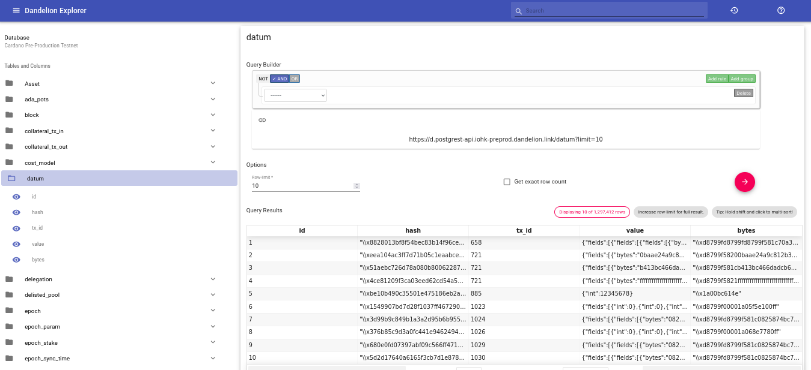

# Dandelion Explorer

**A React web application to build queries and explore Cardano Blockchain using Dandelion's Community Service PostgREST API**

Based on [PostGUI](https://github.com/priyank-purohit/PostGUI), adapted for Cardano Blockchain and the awesome [Dandelion APIs](https://dandelion.link) project.

## Introduction

Developers using Dandelion Community APIs did not have a UI tool to query the PostgREST API. Same as Koios, Blockfrost, and deployments relying on Postgres DB filled by cardano-db-sync or ledger-sync indexers.

  

This tool relies on popular open-source works such as: 
- [Material UI](https://material.io/)
- [PostgREST](http://postgrest.org)
- [JS Query Builder](https://querybuilder.js.org/)
- and more!

## Default Databases

For Dandelion Community Service, the two databases indexed by cardano-db-sync are already configured: 
- Cardano Mainnet
- Cardano Pre-Production Testnet

  

The database picker allows multiple PostgreSQL databases to be shared from a single instance of Dandelion Explorer. The database name is customizable using the `/data/config.json` file.

## Installation

1. Open a new command line terminal.
1. Clone this repository: `git clone https://github.com/GameChangerFinance/dandelion-explorer.git`
1. Navigate into the cloned repository: `cd dandelion-explorer`.
1. Install node dependencies by executing: `npm install`.
1. Using the command line tool, execute `npm start` to run the web application.

## Why?

I cannot think of a more resilient and community focused project on Cardano than [Dandelion APIs](https://dandelion.link). It has stayed with us with or without proper funding, it has born with a huge educational approach from [Gimbalabs](https://www.gimbalabs.com) itself being their flagship API service for years now, and it has been powering projects like [GameChanger Wallet](https://gamechanger.finance) since the very beginning of this ecosystem.

Cardano wont ever be the same without [Dandelion APIs](https://dandelion.link)!

This is a tiny contribution back to the Dandelion Community, for developers and students to have a graphical online tool to not only explore and export queries, but also to be able to build them and use them on their own projects. 

Thanks to [PostGUI](https://github.com/priyank-purohit/PostGUI) creator for the excellent work done.