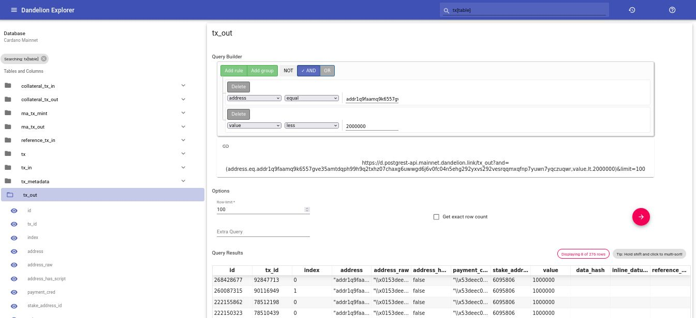
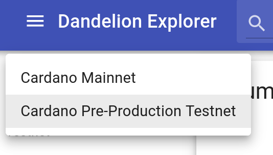
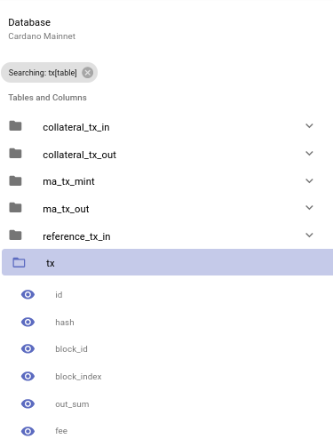
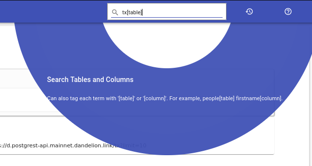
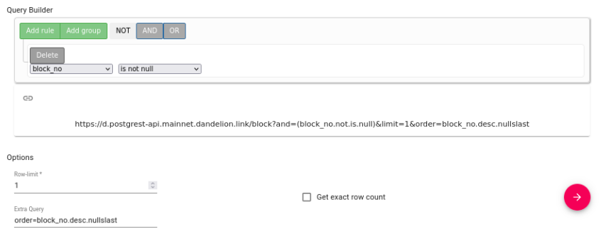
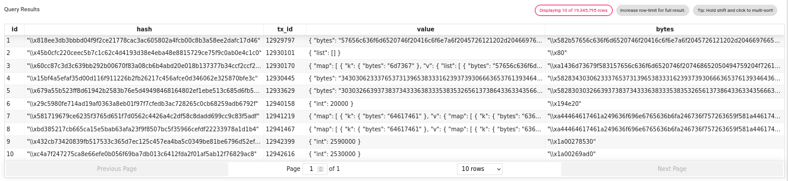
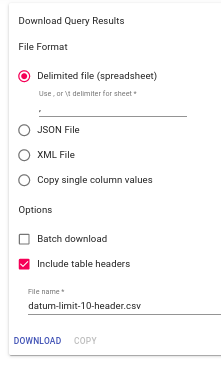
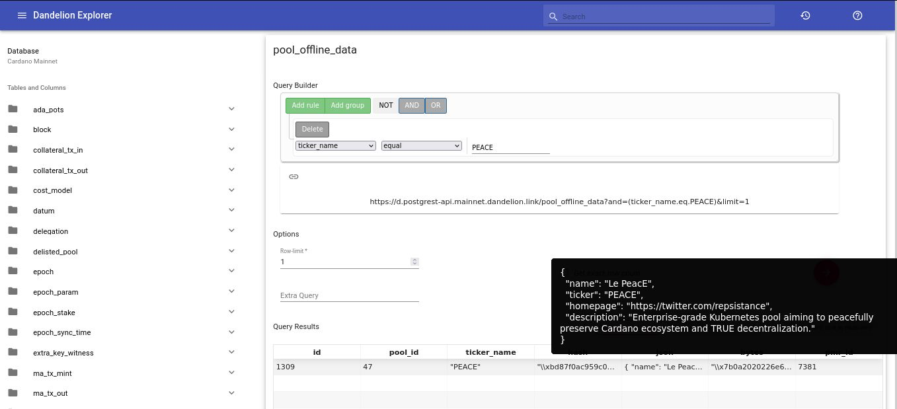
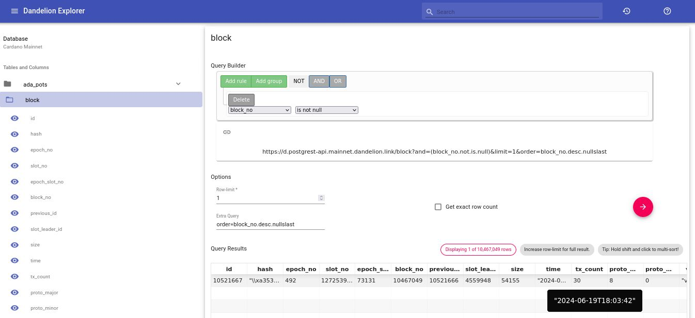

# Dandelion Explorer

**A React web application to build queries and explore Cardano Blockchain using Dandelion's Community Service PostgREST API**

Based on [PostGUI](https://github.com/priyank-purohit/PostGUI), adapted for Cardano Blockchain and the awesome [Dandelion APIs](https://dandelion.link) project.

**🚀 Try it [online](https://dandelion-explorer.gamechanger.finance/)!**

## Table of Contents
1. [ Introduction ](#introduction)
1. [ Cardano Databases ](#cardano-databases)
1. [ Features ](#features)
1. [ Example Queries ](#example-queries)
1. [ Installation ](#installation)
1. [ Why ](#why)

## Introduction

Developers using Dandelion Community APIs did not have a UI tool to query it's PostgREST API. Same as Koios, Blockfrost, and deployments relying on Postgres DB filled by [cardano-db-sync](https://github.com/IntersectMBO/cardano-db-sync) or [cf-ledger-sync](https://github.com/cardano-foundation/cf-ledger-sync) indexers.

>PostgREST is a standalone web server that turns a PostgreSQL database directly into a RESTful API. The structural constraints and permissions in the database determine the API endpoints and available operations. Keep in mind PostgREST syntax offer a subset of PostgreSQL query features, not all of them.

  

This tool relies on popular open-source works such as: 
- [Material UI](https://material.io/)
- [PostgREST](http://postgrest.org)
- [JS Query Builder](https://querybuilder.js.org/)
- and more!

## Cardano Databases

For Dandelion Community Service, it's two databases indexed by [cardano-db-sync](https://github.com/IntersectMBO/cardano-db-sync) are already pre-configured out of the box: 
- Cardano Mainnet
- Cardano Pre-Production Testnet

>Currently a provisional Pre-Production Testnet database from GameChanger Finance Team (GC) has been added to contribute as alternative during late community nodes downtimes. Please contact [Dandelion Project](https://dandelion.link/) or us if you want to contribute with your own nodes as well to decentralize Cardano even further!

## Features

### Data Compatibility

Dandelion Explorer is designed to be database agnostic by automatically adapting to the client's database schema. This framework can be setup to query and share a biology, finance, or a sports statistics PostgreSQL database. In short, any tabular data set can be accessed and shared using this framework. If the data set(s) in question can be represented as tables, then the data set(s) is compatible with this framework. Complex data types such as images, videos, or sound clips are currently untested and unsupported.

This is why Dandelion-Explorer is quite ready for working with the upcoming [cf-ledger-sync](https://github.com/cardano-foundation/cf-ledger-sync) indexer, same way as it is currently supporting [cardano-db-sync](https://github.com/IntersectMBO/cardano-db-sync): both indexers aggregate and process live data from a Cardano Node and store it on PostgresDb.

For Cardano some adjustments has been introduced, for example to deal with it's data types, such as formatting as JSON some serialized structures originally coming from CBOR and JSON objects.

### Database Picker

  

The database picker allows multiple PostgreSQL databases to be shared from a single instance of Dandelion Explorer. The database name and PostgREST instance URL are customizable using the `/data/config.json` file. You can add your own Dandelion nodes from there on your local setup.

### Database Schema

  

The database schema (tables, columns, and foreign keys) is shown in the left panel of the Dandelion Explorer user interface (UI). The tables and columns can be renamed for a more user-friendly table and column name. Foreign Keys also are shown with “Referenced by” and “FK to” labels.

### Search Feature

  

Search feature can be used to find a table or column quickly. To search for a specific table vs. a column, each search term can be tagged with ‘[table]’ or ‘[column]’.

### Query Builder and Query Options

  

Integration of the [JS Query Builder](https://querybuilder.js.org/) in this web application makes it easily usable by users unfamiliar with PostgREST or SQL programming language. Query options can be used to fine tune the data being extracted from the database, and to ensure the full result is being shown (exact row count feature).

The **Row Limit** and **Extra Query** fields has been introduced to allow you to constrain your results to a limited number of rows and customize your query with a manual PostgREST expression that can be used for example to sort your results specially if you are using your own data formatting.

### Data Table

  

The query result component features a high-performance data table ([React Table](https://github.com/tannerlinsley/react-table)) that can sort columns by their values locally in addition to any query-level ordering.

### Download Data

  

The Downloads card features options to download the currently loaded data in CSV, JSON, and XML formats. In addition, it allows for column values to be copied as comma-separated values – this may be used in lieu of a join-table VIEW.

## Example Queries

For learning how to make PostgREST queries, it's syntax and features, visit the official [PostgREST Documentation](https://postgrest.org/).

You can build complex queries directly on PostgREST but here you have some examples you can generate graphically using Dandelion Explorer's Query Builder.

Because PostgREST let you run requests through the GET method, in addition to replicating these on Dandelion Explorer you can try them out here by just clicking on the **▶️ links** or opening them on a new tab.

### Get Stake Pool Offline Metadata by ticker name

It filters out all the pools offline metadata entries that don't have `PEACE` as `ticker_name`.

Notice that **Query Builder** normalizes URLs by wrapping filters on a `OR`, `AND` or `NOT` condition, in this case an `AND` by default.

[https://d.postgrest-api.mainnet.dandelion.link/pool_offline_data?and=(ticker_name.eq.PEACE)&limit=1](https://d.postgrest-api.mainnet.dandelion.link/pool_offline_data?and=(ticker_name.eq.PEACE)&limit=1)

  

>Do you want to contribute with **Dandelion APIs**? Delegate to **PEACE** pool!

### Last Indexed Block

It filters out all blocks that have a null `block_no` and leverages on sorting them by `block_no` with an **Extra Query** and applying a **Row Limit** of 1 to fetch only the latest block.

▶️ [https://d.postgrest-api.mainnet.dandelion.link/block?and=(block_no.not.is.null)&limit=1&order=block_no.desc.nullslast](https://d.postgrest-api.mainnet.dandelion.link/block?and=(block_no.not.is.null)&limit=1&order=block_no.desc.nullslast)

  

### Outputs of less than 2 ADA to a specific address

It groups 2 filters under the `AND` condition, one that filters out all transaction outputs that are not sent to a specific `address` and other that filters out all outputs with a `value` of more than 2 ADAs (`2000000` lovelaces, the quantity unit we use on Cardano).

▶️ [https://d.postgrest-api.mainnet.dandelion.link/tx_out?and=(address.eq.addr1q9faamq9k6557gve35amtdqph99h9q2txhz07chaxg6uwwgd6j6v0fc04n5ehg292yxvs292vesrqqmxqfnp7yuwn7yqczuqwr,value.lt.2000000)&limit=100](https://d.postgrest-api.mainnet.dandelion.link/tx_out?and=(address.eq.addr1q9faamq9k6557gve35amtdqph99h9q2txhz07chaxg6uwwgd6j6v0fc04n5ehg292yxvs292vesrqqmxqfnp7yuwn7yqczuqwr,value.lt.2000000)&limit=100)

  

## Installation

1. Open a new command line terminal.
1. Clone this repository: `git clone https://github.com/GameChangerFinance/dandelion-explorer.git`
1. Navigate into the cloned repository: `cd dandelion-explorer`.
1. Install node dependencies by executing: `npm install`.
1. Using the command line tool, execute `npm start` to run the web application.

For further details about deployment, database setup, security tips and other use cases please head to [PostGUI Project](https://github.com/priyank-purohit/PostGUI).

## Why?

I cannot think of a more resilient and community focused project on Cardano than [Dandelion APIs](https://dandelion.link). It has stayed with us with or without proper funding, it has born with a huge educational approach from [Gimbalabs](https://www.gimbalabs.com) itself being their flagship API service for years now, and it has been powering projects like [GameChanger Wallet](https://gamechanger.finance) since the very beginning of this ecosystem.

Cardano wont ever be the same without [Dandelion APIs](https://dandelion.link)!

This is a tiny contribution back to the Dandelion Community, for developers and students to have a graphical online tool to not only explore and export queries, but also to be able to build them and use them on their own projects. 

Thanks to [PostGUI](https://github.com/priyank-purohit/PostGUI) creator for the excellent work done.